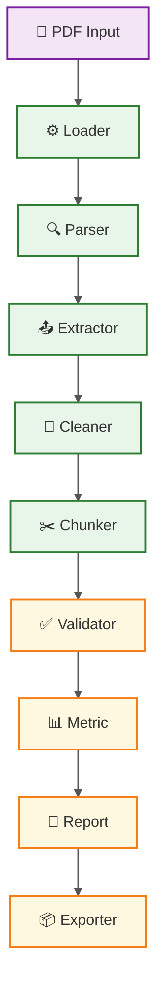

# 1️⃣ pipline结构图

# 2️⃣ 模块职责 

1、 Loader 
    职责: 读取源文件信息（Load source file information）

    输出: Document object 

2、Parser
    职责: 解析文档（Parse PDF content and generate pages/raw text ）

    输出：document.pages、document.raw_text 

3、Extractor
    职责: 抽取元数据（Extract metadata） 

    输出：document.metadata 

4、Cleaner 
    职责: 删除低质量的内容，规范文本（Remove low-quality content and standardize text） 

    子模块：

        - TextCleaner 

        - HeaderFooterCleaner 

        - OCRNoiseCleaner 

        - PiiCleaner 

    输出：document.cleaned_text、audit_trail、sample_records 

5、Chunker
    职责: 将长文档切分为标准化知识单元（Chunk long documents into standardized knowledge units） 

    输出：document.chunks、chunk metrics 

6、Validator
    职责: 验证数据质量，发现数据质量问题，保证输出数据可用性（Validate data quality, find data problems, ensure output data availability）

    输出：document.validation_results

7、Metric 
    职责: 统计治理过程中的关键质量指标，量化评估数据治理效果，为治理优化和质量监控提供数据支撑（Statistics key quality metrics, quantitatively evaluate data governance effect, provide data support for governance optimization and quality monitoring） 

    输出：document.metrics

8、Report 
    职责: 生成治理报告（Generate governance report） 

    输出：JSON、Markdown、Dataset Report

